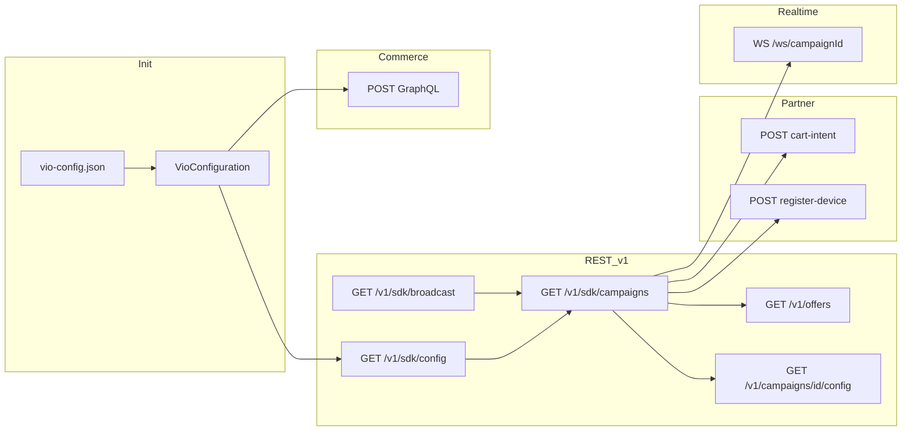

# VioSwiftSDK — Fuente de verdad (técnica)

Documentación canónica del **Swift Package** en este repositorio: flujo de arranque, red (REST, WebSocket, GraphQL), y convenciones. El backend Vio (Express, Postgres, dashboard) no se detalla aquí salvo lo que el SDK consume.

**Última verificación contra código:** `c3198b1` (2026-04-09). Tras cambios en `Sources/**` que afecten a rutas o auth, actualizar la [tabla maestra](#tabla-maestra-requests--propósito) y esta fecha.

---

## 1. Alcance y nomenclatura

| Nombre | Uso |
|--------|-----|
| **Vio.live** | Producto actual — preferir en docs y código nuevo |
| **Reachu** | Legacy en código o API antigua |
| **Tipio** | Otro producto; no confundir con Vio |

**Git:** rama de integración del package: **`develop`**. Features y PRs hacia `develop`, no `main`, salvo instrucción explícita.

**No commitear API keys** en markdown; usar `Demo/*/vio-config.json` locales o secretos.

---

## 2. URLs de entorno (dev)

| Uso | URL típica |
|-----|------------|
| REST campaña / partner | `https://api-dev.vio.live` (valor real: `campaignConfiguration.restAPIBaseURL` en config) |
| WebSocket campaña | `VioConfiguration.wsBaseURL` (p. ej. `wss://ws-dev.vio.live`) + path `/ws/{campaignId}` |
| Commerce GraphQL | Resuelto desde config / bootstrap (`commerce.endpoint` + path `/graphql`) |

---

## 3. Jerarquía de datos (mínimo plataforma)

Útil para entender discovery y `contentId`:

**Client app → campañas → broadcasts → engagement (polls/contests) y componentes.** El SDK descubre campañas por `apiKey` del cliente; el **broadcast** es la unidad de evento en vivo. En base de datos, el ID de contenido del partner suele mapear al broadcast como **`externalId`** (u homónimo en API); el SDK valida **`contentId` + país** con `GET /v1/sdk/broadcast` antes de mostrar engagement en flujos casting.

---

## 4. Módulos SPM

Definición exacta en [`Package.swift`](../Package.swift). Resumen:

| Producto | Rol |
|----------|-----|
| **VioCore** | Config, campaña, REST, modelos, `CampaignWebSocketManager`, analytics |
| **VioNetwork** | Apollo / GraphQL compartido |
| **VioDesignSystem** | UI base |
| **VioUI** | Comercio SwiftUI, checkout (Stripe/Klarna), `ProductService` |
| **VioEngagementSystem** / **VioEngagementUI** | Polls, contests |
| **VioCastingUI** | Partido en vivo, timeline, `LineupService`, player |
| **VioComplete** | Agregado de módulos públicos principales |

Índice de rutas en código: [`CODEBASE_INDEX.md`](CODEBASE_INDEX.md).

---

## 5. Inicialización

No existe un tipo público unificado `VioSDK`.

1. **Demos:** `ConfigurationLoader.loadConfiguration()` (p. ej. `vio-config.json` en el bundle).
2. **Programático:** `VioConfiguration.configure(apiKey:)` u otras sobrecargas en `VioConfiguration.swift`.

Alias: `VioConfigurationLoader` = `ConfigurationLoader` (`VioCore.swift`).

---

## 6. Flujo end-to-end (orden habitual)

1. **Config local** (`vio-config.json` + loader): `restAPIBaseURL`, `apiKey`, `campaignAdminApiKey`, `wsBaseURL`, overrides de commerce, flags tipo `autoDiscover`.
2. **`GET /v1/sdk/config`**: bootstrap de commerce (`commerce.apiKey`, `commerce.endpoint`) y metadatos; puede usar `campaignAdminApiKey` o el admin key efectivo configurado; en flujos con campaña conocida también se usa con `campaignId`. Tras aplicar bootstrap se notifica **`vioCommerceBootstrapDidApply`** para que `ProductService` invalide el cliente GraphQL.
3. **`GET /v1/sdk/broadcast`**: si la app usa **`contentId`** (ID externo del partner) + **`country`**, resuelve si hay broadcast/campaña activa — [`BroadcastValidationService`](../Sources/VioCore/Services/BroadcastValidationService.swift), usado desde casting/player.
4. **`GET /v1/sdk/campaigns`**: discovery con el **SDK `apiKey`** (`VioConfiguration.shared.apiKey`), opcionalmente filtrado por `broadcastId` / flujo zero-config. Implementado en [`CampaignManager`](../Sources/VioCore/Managers/CampaignManager.swift).
5. **`GET /v1/offers`**: solo si el discovery **no** devolvió componentes; evita sobrescribir componentes ya obtenidos.
6. **Config dinámica por campaña / engagement / copy**: `ConfigAPIClient` — `GET /v1/campaigns/{id}/config`, `GET /v1/engagement/config`, `GET /v1/localization/{language}`.
7. **Engagement REST**: polls/contests y votos — [`BackendEngagementRepository`](../Sources/VioEngagementSystem/Data/BackendEngagementRepository.swift).
8. **Lineup**: `GET /v1/sdk/broadcasts/{broadcastId}/lineup` — [`LineupService`](../Sources/VioCastingUI/Managers/Match/LineupService.swift).
9. **Partner HTTP** (`x-api-key` con `resolvedSdkApiKey`): `POST /api/campaigns/{id}/cart-intent`, `POST /api/campaigns/{id}/register-device` — [`VioCampaignPartnerAPI`](../Sources/VioCore/Network/VioCampaignPartnerAPI.swift), orquestado desde `CampaignManager`.
10. **WebSocket**: `CampaignWebSocketManager` — URL `{wsBaseURL}/ws/{campaignId}`, header `X-API-Key` si hay `apiKey`; opcional `?userId=` y mensaje saliente `identify` si `userId` está definido.
11. **Commerce**: operaciones GraphQL (carrito, checkout, pagos) vía `SdkClient` / `ProductService`; definición de operaciones en [`GraphQLOpsSingleFile.swift`](../Sources/VioCore/Sdk/Core/GraphQL/GraphQLOpsSingleFile.swift). La autorización GraphQL prioriza la clave **commerce** del bootstrap frente al `apiKey` de campaña cuando aplica.

### CampaignManager (acceso)

- Correcto: **`CampaignManager.shared`**.
- **`VioConfiguration.campaignManager` no existe.**

### discoverCampaigns

- API pública canónica: **`discoverCampaigns(broadcastId: String?)`**. Usa `apiKey` del SDK en `/v1/sdk/campaigns`.
- **`discoverCampaigns(matchId:)`** está deprecado (delega en `broadcastId`). Para evitar ambigüedad de overloads: `await discoverCampaigns(broadcastId: nil)` o pasa un string explícito.

---

## 7. Tabla maestra: requests → propósito

Base URL REST: `campaignConfiguration.restAPIBaseURL` salvo nota. *Auth* resume el contrato en código; detalles en el archivo citado.

| Método | Ruta | Auth (resumen) | Llamador principal | Propósito |
|--------|------|----------------|-------------------|-----------|
| GET | `/v1/sdk/config` | Query `apiKey` (admin / efectivo según método); a veces `campaignId` | `CampaignManager` | Bootstrap commerce, endpoints, flags |
| GET | `/v1/sdk/campaigns` | Query `apiKey` (SDK) | `CampaignManager` | Listar campañas / estado; discovery |
| GET | `/v1/sdk/broadcast` | Query `apiKey`, `contentId`, `country` | `BroadcastValidationService` | Validar contenido externo → broadcast/campaña |
| GET | `/v1/offers` | Query `apiKey`, `campaignId` | `CampaignManager` | Componentes/ofertas si discovery sin componentes |
| GET | `/v1/campaigns/{id}/config` | Query `apiKey` | `ConfigAPIClient` | Config dinámica por campaña |
| GET | `/v1/engagement/config` | Query `apiKey`, `broadcastId` | `ConfigAPIClient` | Config engagement |
| GET | `/v1/localization/{lang}` | Query `apiKey` | `ConfigAPIClient` | Cadenas UI |
| GET | `/v1/engagement/polls` | Query `apiKey`, `broadcastId` (u homónimos) | `BackendEngagementRepository` | Polls por broadcast |
| GET | `/v1/engagement/contests` | Query `apiKey`, `broadcastId` | `BackendEngagementRepository` | Contests por broadcast |
| POST | `/v1/engagement/polls/{id}/vote` | Query + body | `BackendEngagementRepository` | Votar |
| POST | `/v1/engagement/contests/{id}/participate` | Query + body | `BackendEngagementRepository` | Participar |
| GET | `/v1/sdk/broadcasts/{id}/lineup` | Query `apiKey` | `LineupService` | Alineación del partido |
| POST | `/api/campaigns/{id}/cart-intent` | Header `x-api-key` (SDK resuelto) | `VioCampaignPartnerAPI` / `CampaignManager` | Intención de carrito hacia backend |
| POST | `/api/campaigns/{id}/register-device` | Header `x-api-key` | `VioCampaignPartnerAPI` / `CampaignManager` | Registrar token push |
| GET | `/api/campaigns/{id}/active-components` | (según `ComponentManager`) | `OfferBannerModels` / `ComponentManager` | Componentes activos (ruta legacy/demo) |
| POST | `/api/checkout/confirm-apple-pay` | (confirmación tras Apple Pay) | `ApplePayManager` | Confirmar pago Apple Pay con backend |
| WS | `{wsBaseURL}/ws/{campaignId}` | Header `X-API-Key`; opcional `?userId=` | `CampaignWebSocketManager` | Eventos de campaña en tiempo real |
| POST | `{graphqlURL}` | Header `Authorization` (commerce / fallback) | `ProductService` / `SdkClient` | Catálogo, carrito, checkout, pagos |

---

## 8. WebSocket de campaña: eventos

Mensajes entrantes con campo **`type`** manejados en `CampaignWebSocketManager.handleMessage`:

- `campaign_started`, `campaign_ended`, `campaign_paused`, `campaign_resumed`
- `component_status_changed`, `component_config_updated`
- `config:updated` → `DynamicConfigurationManager`
- `lineup_show`
- `cart_intent` → `CartIntentEvent` + notificación local opcional
- `ping` → respuesta `pong`

Tras conectar, si hay `userId`, se envía **`{"type":"identify","userId":"..."}`**.

---

## 9. Contrato cart_intent (envelope + push)

Alineación entre WS, push y SDK:

- **Envelope canónico:** `vio_notification_version`, `vio_user_id` (opcional), `vio_event_type` (`cart_intent`), `vio_payload` con `product_id`, `campaign_id`, `product_name`, opcionales `source`, `deeplink`.
- **Swift:** `CartIntentEvent.parse(jsonData:)` (WS) y `CartIntentEvent.from(userInfo:)` (push). Claves planas legacy (`vio_cartIntent_*`, etc.) aún aceptadas durante migración.
- **Commerce:** GraphQL usa **`commerce.apiKey`** (y endpoint) del bootstrap **`GET /v1/sdk/config`**, no el `apiKey` de campaña, cuando el backend lo provee. Sin `commerceApiKey` en sponsor/campaña, puede fallar GraphQL con `UNAUTHENTICATED` al depender solo del `apiKey` de campaña.

---

## 10. Broadcast context y auto-discovery

- **`broadcastId`** lo define el backend; el SDK lo recibe (metadata del partner o validación `contentId`).
- **`VioSessionContext`**: contexto inyectado (userId, `BroadcastContext`); no es el único singleton global para toda la app.
- **`autoDiscover: true`** en config: usa `discoverCampaigns` sin fijar `liveShow.campaignId`. **`false`**: modo legacy con `campaignId` en config.
- Flujo típico casting: establecer `BroadcastContext` → `discoverCampaigns(broadcastId:)` → `setBroadcastContext` según integración.

Detalle de UI: [`VCastingVideoPlayer`](../Sources/VioCastingUI/Components/Video/VCastingVideoPlayer.swift), [`LiveMatchView`](../Sources/VioCastingUI/Views/LiveMatchView.swift).

---

## 11. Componentización y marca (demos)

Para cambiar marca/assets entre demos sin hardcodear: `demo-static-data.json` + `vio-config.json`, merge en `VioConfiguration` / `DemoDataManager`. Lista de vistas que consumen `brandAsset` / fondos en módulos **VioCastingUI** — ver sección equivalente antigua consolidada aquí; archivos clave: `DemoDataManager`, `VioConfiguration.swift`, `ModuleConfigurations.swift`.

---

## 12. Engagement y sincronización con vídeo

Polls/contests pueden incluir campos de tiempo relativos al inicio del broadcast (p. ej. `videoStartTime` / `videoEndTime`) además de timestamps absolutos; el cliente los consume vía **`BackendEngagementRepository`** y modelos en VioEngagementSystem. Base URL y `apiKey` como en la tabla maestra.

---

## 13. Pendientes conocidos en código

- **`ComponentManager`** / URL de event-streamer histórica en `OfferBannerModels.swift`: revisar `baseURL` hardcodeada; alinear con `restAPIBaseURL` de config cuando proceda.
- **Demos** (`Demo/`): código de app de ejemplo, no API pública del package.
- Tareas ad-hoc bajo **`Demo/tv2demo/`** (ficheros `TAREA_*.md`) son notas locales de demo.

---

## 14. Tests

`Tests/VioCoreTests/` (y otros si existen). Desde la raíz del package: `swift test`.

---

## 15. Historial de notas Replit / contentId

La validación **`contentId` + país** quedó implementada en el SDK como **`GET /v1/sdk/broadcast`**. Preguntas y borradores dirigidos al socket-server sobre el mismo tema (**`PREGUNTAS_*`**, **`PROMPT_*`**, **`RESPUESTAS_*`**, **`REVISION_*`**) se eliminaron del árbol en favor de este documento para evitar cuatro fuentes paralelas.
